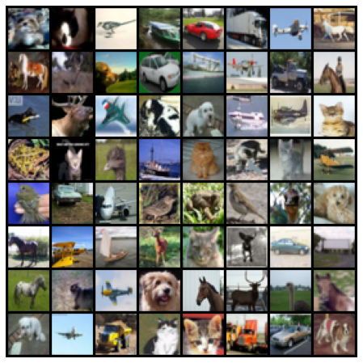

# A convolutional network on CIFAR-10

CIFAR-10 is dataset of 60,000 colour pictures divided in 10 categories (*airplane*, *automobile*, *bird*, *cat*, *deer*, *dog*, *frog*, *horse*, *ship* and *truck*) and 32x32 pixels in size.

This dataset is often used to test image classification algorithms. This repository presents a simple convolutional neural network trained on this dataset.

